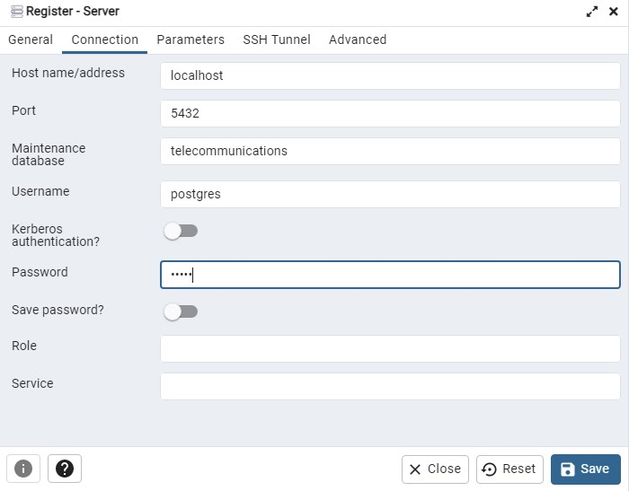
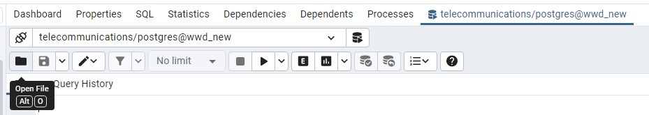

**Module**: Data 9910 – Working with Data

**Lecturer**: Lucas Rizzo

**Class Group**: TU059/060/256

**Worth**: 20%

**Due Time**: Before next class on Week 6.

**Programming Language**: The test can be done in both `R` or `Python`. There is also an .ipynb notebook if you prefer it.

### Submission

Please submit this notebook and additional files (if any) in a zip file. ***Submissions without a report won't be accepted.***

# Problem description

A telecommunications company is starting a data project to improve their customer analytics capabilities. During informal interviews with the stakeholders, the following were suggested as possible features for the system:

-   identify trends by certain types of customers

-   identify trends by certain types of calls

-   identify relevant statistical information of overall calls performed by customers

# Dataset

The company has provided you with an sql dump in two files (`db.ddl` and `data.sql`) to replicate their PostgreSQL database. However, they are not very organised and did not provide a documentation alongside it. Hence, you will be required to recreate it and do some investigation to understand their data. Note that a ddl file also containts sql commands, but only those that describes the portion of SQL that creates, alters, and deletes database objects

### Create a new local database

Using pgAdmin create a new database to run the sql files.



You can use the parameters below to create the databse. If you use different ones you will need to remember them to connect to the database.

`user = 'postgres'`

`password = 'admin'`

`host = 'localhost'`

`port = 5432`

`database = 'telecommunications'`

### Import the data

Using the query tool open the `db.ddl` file and run the commands to create the necessary tables. After that, open the `data.sql` to run the insert commands and add all the data to the database (this can take around 20 seconds to run).



### QUESTION 1

Using your preferred language (R or Python) create a connection object to the companies database. (1 mark)

```{r}

```

### QUESTION 2

Extract the ERD from the database (via PgAdmin). Write a general description of the database structure (2 marks)

# Customer information

Query the database to extract the following information:

a)  The overall number of customers (1 mark)

```{r}

```

b)  The number of customers by year of DOB in descending order (2 marks)

```{r}

```

c)  Analyse the query below and describe what is the result given by it. (1 mark)

```{r}
query <- "SELECT c.phonenumber, SUM(cr.costperminute * c.duration) AS total_amount_spent"

query <- paste(query, "FROM public.calls c INNER JOIN public.call_rates cr ON c.callrate = cr.callrate")

query <- paste(query, "WHERE c.connectionid NOT IN ( SELECT DISTINCT connectionid FROM public.customer_service)")

query <- paste(query, "GROUP BY c.phonenumber ORDER BY c.phonenumber;")

result <- dbGetQuery(con, query)
result
```

d)  There is a logical error on the result of the above query. As a telecommunications specialist, you have observed that the `total_amount_spent` returned is too high for the usual expected values in this industry. Please fix the query so that values falls in a reasonable range. (1 mark)

```{r}

```

e)  Given the correct query for the `total_amount_spent` spent, identify the min, max and average revenue gererate by overall phone numbers (1 mark)

```{r}

```

# Calls information

### Question 4

Query the database to extract the following information:

a)  The average call duration in minutes by phone number, excluding those made to the customer service (2 marks)

```{r}

```

b)  The number of calls made to customer support by phone number (2 marks)

```{r}

```

c)  The number of calls made by call rate (2 marks)

```{r}

```

# Report

Describe your findings in a short report, summarizing the information you have collected from previous questions and giving some interpretation of results. You might for example generate a table with results, and give some interpretation in a few sentences. You can also imagine you are an analyst interested in reading this report and collecting the most important information extracted from the data. (5 marks)

```{r}
# Add any code here
```

Add any text here
