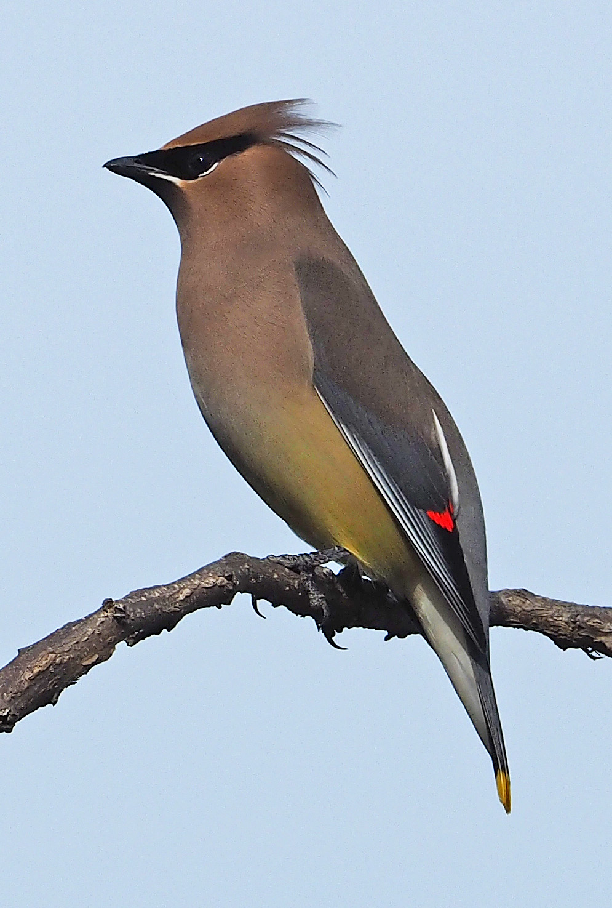

### Bioacoustic audio signals analysis with R

For this lab, we are going to analyse some bioacoustic audio signals from the [`warbleR`](https://marce10.github.io/warbleR/articles/Intro_to_warbleR.html) package. The goal is to analyze the recordings of [Cedar Waxwings](https://en.wikipedia.org/wiki/Cedar_waxwing) from the xeno-canto database to determine whether or not there is variation in different bird vocalization types (sounds that birds produce as a form of communication).

 {width="229"}

You can listen an example below (need to knit the notebook as html, or open the file in the folder)

<audio controls>

<source src="Bombycilla_cedrorum.ogg" type="audio/wav">

</audio>

### Loading the data

Load the dataframe `cedarWax_data.rds`. It contains information on 232 recordings of Xeno-Canto

```{r}
cedarWax <- readRDS("cedarWax_data.rds")
```

The `maps` package can be used to generate a map of the globe. With that, we can plot the geographic spread of Xeno Canto recordings using their latitude and longitude features.

```{r}
library(ggplot2)
library(maps)
# Get the US map data
world_map <- map_data("world")
ggplot() +
  # Plot the USA map as a polygon layer
  geom_polygon(data = world_map, aes(x = long, y = lat, group = group), fill = "white", color = "black") +
  # Add your cedarWax data as a point layer
  geom_point(data = cedarWax, aes(x = Longitude, y = Latitude), color = "blue", size = 2) +
  labs(title = "Cedar Waxwing Locations")
```

### **Vocalization types**

For this exercise we are going to analyse different types of bird vocalizations visually. The `vocalization_type` column gives you the types of vocalizations contained in the dataset. In specific, we will be checking 4 types:

1.  **Song:** Primarily used by birds for mating calls and territorial defense
2.  **Begging Call:** Used by chicks or fledglings to solicit food from their parents
3.  **Alarm Call**: Warns other birds of predators or danger
4.  **Flight Call:** Communication during flight, often used to maintain flock cohesion

### Task 1 (1 marks)

**a)** Create a subset of the `cedarWax` dataframe containing only these four types of vocalization. You can match the full value of `Vocalization_type`, ignoring records that contain multiple values.

```{r}
```

**b)** `seewave` is designed to work with wav files while the xeno-canto database stores *some* of its recordings as mp3 files. First we are going to download all the audio files and then convert the mp3 files to wav using `writeWave`.

To download file you can use the code:

`download.file(url = file_url, destfile = dest_path, mode = "wb")`

The `file_url` can be set using the `Audio_file` column, while `dest_path` can be set as the `file.name` column

PS: If the download fails or the package stops responding, I have shared the files [here](https://drive.google.com/drive/folders/1nazaSzRZf5ttoo8ZsMFcEogFxij6NiMo?usp=sharing).

```{r}
```

Read the .mp3 files with `readMP3` and write it to .wav with the `writeWave` function. You will need to check the file extension to see which file names end in `.mp3`. You can save the `wav` version with the same names. For example, if you have a file `CEDW 2.mp3` file, you should have a new one `CEDW 2.wav` after calling `writeWave`.

```{r}
```

### Task 2 (3 marks)

Modify the function to describe audio created in class. Instead of printing information, build a dataframe containing summary statistics for the files generated in Task 2. Keep the `Recording_ID` and `Vocalization_type` of each record so we can analyse them separately after. Try to include as much information as possible for each recording.

```{r}

```

### Task 3 (3 marks)

a)  Plot the spectograms for `vocalization_type` Song for the .wav files produced in Task 3.

```{r}

```

b)  Plot the spectograms for `vocalization_type` Begging Call for the .wav files produced in Task 3.

```{r}

```

c)  Plot the spectograms for `vocalization_type` Alarm call for the .wav files produced in Task 3.

```{r}

```

d)  Plot the spectograms for `vocalization_type` Flight call for the .wav files produced in Task 3.

```{r}

```

### **Task 4 (3 marks)**

The vocalization types analysed have distinct characteristics. For example:

1.  **Song**: Songs often have clear, repeated patterns and are more complex compared to calls.

2.  **Begging Call**: These calls are high-pitched and repetitive, making them visually distinct.

3.  **Alarm Call**: These are usually sharp and short.

4.  **Flight Call**: These calls are brief and often occur in sequences, showing unique temporal patterns.

Are you able to identify any of these patterns in the description of the audio files created in Task 2 and the spectograms produced in Task 3? Write a report justifying your answer based on any insights observed (or not) so far. You might give examples of files where patterns have been observed. You can also investigate patterns by exploring the stats in a usual way (boxplots, bar charts, etc).
