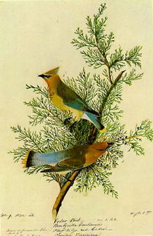

### Bioacoustic audio signals analysis with R

For this lab, we are going to analyse some bioacoustic audio signals from the [`warbleR`](https://marce10.github.io/warbleR/articles/Intro_to_warbleR.html) package. The goal is to analyze the recordings of [Cedar Waxwings](https://en.wikipedia.org/wiki/Cedar_waxwing) from the xeno-canto database to determine whether or not there is variation in different bird vocalization types (sounds that birds produce as a form of communication).

 {width="229"}

You can listen an example below (need to knit the notebook as html, or open the file in the folder)

<audio controls>

<source src="Bombycilla_cedrorum.ogg" type="audio/wav">

</audio>

### Loading the data

Load the dataframe `cedarWax_data.rds`. It contains information on 232 recordings of Xeno-Canto

```{r}
library(ggplot2)
library(maps)
library(dplyr)
library(tuneR)

# load datafram
cedarwax <- readRDS("cedarWax_data.rds")

#convert all headers to lwoer case as was gettign a few errors as I went along
names(cedarwax) <- tolower(names(cedarwax))
print(paste0("Number of rows = " , (nrow(cedarwax))))
print(paste0("Number of cols = " ,  (ncol(cedarwax))))
# str(cedarwax)
names(cedarwax)
```

The `maps` package can be used to generate a map of the globe. With that, we can plot the geographic spread of Xeno Canto recordings using their latitude and longitude features.

```{r}
# library(ggplot2)
# library(maps)
# Get the US map data
world_map <- map_data("world")
ggplot() +
  # Plot the USA map as a polygon layer
  geom_polygon(data = world_map, aes(x = long, y = lat, group = group), fill = "white", color = "black") +
  # Add your cedarWax data as a point layer
  # changed longtitude and latitude to lowercase to ti into above change fo headers to lower
  geom_point(data = cedarwax, aes(x = longitude, y = latitude), color = "blue", size = 2) +
  labs(title = "Cedar Waxwing Locations")
```

### **Vocalization types**

For this exercise we are going to analyse different types of bird vocalizations visually. The `vocalization_type` column gives you the types of vocalizations contained in the dataset. In specific, we will be checking 4 types:

1.  **Song:** Primarily used by birds for mating calls and territorial defense
2.  **Begging Call:** Used by chicks or fledglings to solicit food from their parents
3.  **Alarm Call**: Warns other birds of predators or danger
4.  **Flight Call:** Communication during flight, often used to maintain flock cohesion

### Task 1 (1 marks)

**a)** Create a subset of the `cedarWax` dataframe containing only these four types of vocalization. You can match the full value of `Vocalization_type`, ignoring records that contain multiple values.

```{r}
# check how many voc types there are, will allow us double check we got expected dataframe after we create subset
print("==== original dataframe with all voc types ====")
voc_types <- levels(as.factor(cedarwax$vocalization_type))
voc_types
num_voc_types <- length(voc_types)
print(paste0(" Total number of different voc types in original df  = ", num_voc_types))

# craete list with the 4 types of song we're interested in, we'll reference this when filtering
four_voc_types <- c("song", "begging call", "alarm call", "flight call")

#craete object to store a count of vic types as we loop throgh them, just so can check we are right after create subset
sum_four_voc_types <- 0

# just view how many types are present of what we're interested in
for (i in four_voc_types) {
  #print(as.character(i))
  print(i)
  temp <- dplyr::filter(cedarwax, vocalization_type == i)
  count_i <- nrow(temp)
  sum_four_voc_types <- sum_four_voc_types + count_i
  #print(summarise(temp, total = sum(total))$total[[1]])
  print(nrow(temp))
}
print(paste0(" Total number of 4 voc types  = ", sum_four_voc_types))


# create the new dataframe with those 4 call types, filtering the original df by rows so leave column blank after comma
cedarwax_four_df <- cedarwax[cedarwax$vocalization_type %in% four_voc_types, ]

# just view how many types are present of what we're interested in
print("==== new subset with 4 voc types ====")
unique(cedarwax_four_df$vocalization_type)
print(paste0(" number of unique vocalization types = ", (length(unique(cedarwax_four_df$vocalization_type)))))
print(paste0(" number of rows in new df = ", nrow(cedarwax_four_df)))
print(paste0("number of cols in new df = ", ncol(cedarwax_four_df)))

head(cedarwax_four_df)


```

**b)** `seewave` is designed to work with wav files while the xeno-canto database stores *some* of its recordings as mp3 files. First we are going to download all the audio files and then convert the mp3 files to wav using `writeWave`.

To download file you can use the code:

`download.file(url = file_url, destfile = dest_path, mode = "wb")`

The `file_url` can be set using the `Audio_file` column, while `dest_path` can be set as the `file.name` column

PS: If the download fails or the package stops responding, I have shared the files [here](https://drive.google.com/drive/folders/1nazaSzRZf5ttoo8ZsMFcEogFxij6NiMo?usp=sharing).

```{r}
# ref > https://stackoverflow.com/questions/7779037/extract-file-extension-from-file-path 
# modified this from what was provided provided to make it easier for me to track the variables, i.e. changed est_path to file_name
# re-used dest path to include a sub folder to place the files in
file_url <- cedarwax_four_df$audio_file
file_name <- cedarwax_four_df$recording_id

# some file names have characters which are not handled well when copying, get failed copies
# modifying approch here to modify the fle name and then copy
# get the original file name into an object
orig_name <- cedarwax_four_df$file.name
# get the file extension from the file name as some wav and mp3 files, need to separate so cna run regex on file name
file_type_ext <- tools::file_ext(orig_name) 
# have a look
orig_name
file_type_ext


# run regex on file name to get filename into format can copy all files succesfully
# onyl take upper , lower case alpha and numeric characters, underscore and hyphen, nothing else
# any forbidden character replace with an underscore i.e. no brackets, spaces, parenthesis, < >, slahes, commas etc
# re-attache the file extension .wav and mp3
regexd_filename <- gsub("[^A-Za-z0-9_-]", "_", tools::file_path_sans_ext(orig_name))
# have to also put character limit on file names as some are too big and nto copying
max_len <- 40
# modify the original filename then re-attach the extension
regexd_charlim_filename <- substr(regexd_filename, 1, max_len)
regexd_charlim_ext_filename <- paste0(regexd_charlim_filename, ".", file_type_ext)
regexd_charlim_ext_filename <- tolower(regexd_charlim_ext_filename)


#Amend this to reflect your folder structure, if it doesn't exist create the folder
datalocation <- file.path("./dwnlod")
if (!dir.exists(datalocation)) dir.create(datalocation)

# where to copy to with amended file name
dest_path <- file.path(datalocation,regexd_charlim_ext_filename)


#download the aaudio files
download.file(url = file_url, destfile = dest_path, mode = "wb")
```

Read the .mp3 files with `readMP3` and write it to .wav with the `writeWave` function. You will need to check the file extension to see which file names end in `.mp3`. You can save the `wav` version with the same names. For example, if you have a file `CEDW 2.mp3` file, you should have a new one `CEDW 2.wav` after calling `writeWave`.

```{r}
# dir.exists("./dwnlod")

# get object with all files in the folder and get the numebr of files in the folder, just using length function
all_audio_files <- list.files("./dwnlod", full.names = TRUE)
print(paste0("You have ", length(all_audio_files), " audio files in total"))

# using file_ext create wav and mp3 objects to work on and then again get the length of those objects to get the number of files for each
mp3_files <- all_audio_files[tools::file_ext(all_audio_files)== "mp3"]
print(paste0("You have ", length(mp3_files), " mp3 files"))
wav_files <- all_audio_files[tools::file_ext(all_audio_files)== "wav"]
print(paste0("You have ", length(wav_files), " wav files"))


for (f in mp3_files)
{
  audio_mp3 <- readMP3(f)
  new_wav_file <- sub(".mp3", ".wav", f)
  writeWave(audio_mp3, new_wav_file)
  print(paste0(" converted ", f)


 }
```

### Task 2 (3 marks)

Modify the function to describe audio created in class. Instead of printing information, build a dataframe containing summary statistics for the files generated in Task 2. Keep the `Recording_ID` and `Vocalization_type` of each record so we can analyse them separately after. Try to include as much information as possible for each recording.

```{r}


audio_wav <- readWave("Bombycilla-cedrorum-313682.wav")
audio_mp3 <- readMP3("Bombycilla-cedrorum-313682.mp3")


```

### Task 3 (3 marks)

a)  Plot the spectograms for `vocalization_type` Song for the .wav files produced in Task 3.

```{r}

```

b)  Plot the spectograms for `vocalization_type` Begging Call for the .wav files produced in Task 3.

```{r}

```

c)  Plot the spectograms for `vocalization_type` Alarm call for the .wav files produced in Task 3.

```{r}

```

d)  Plot the spectograms for `vocalization_type` Flight call for the .wav files produced in Task 3.

```{r}

```

### **Task 4 (3 marks)**

The vocalization types analysed have distinct characteristics. For example:

1.  **Song**: Songs often have clear, repeated patterns and are more complex compared to calls.

2.  **Begging Call**: These calls are high-pitched and repetitive, making them visually distinct.

3.  **Alarm Call**: These are usually sharp and short.

4.  **Flight Call**: These calls are brief and often occur in sequences, showing unique temporal patterns.

Are you able to identify any of these patterns in the description of the audio files created in Task 2 and the spectograms produced in Task 3? Write a report justifying your answer based on any insights observed (or not) so far. You might give examples of files where patterns have been observed. You can also investigate patterns by exploring the stats in a usual way (boxplots, bar charts, etc).
