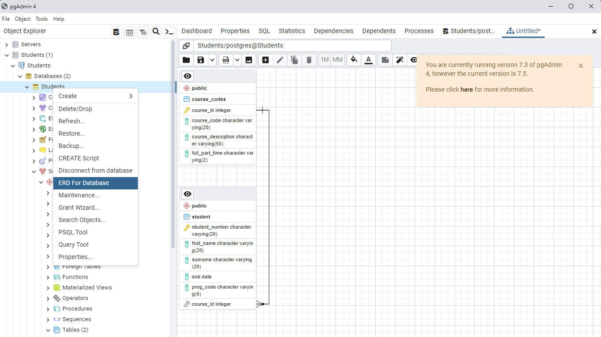

# Establishing connections

In R the [`DBI`](https://dbi.r-dbi.org/) package is important package that provides a consistent interface for connecting to and interacting with databases. It serves as a foundational layer for working with databases in R. It's used by higher-level packages like `dplyr` and `dbplyr` to connect to databases and perform SQL operations.

```{r}
# To install on conda "conda install -c r r-dbi"
# install.packages("DBI")
library(DBI)
```

To connect to a PostgreSQL database you will need the `RPostgres` package.

```{r}
# To install on conda "conda install -c conda-forge r-rpostgres"
# install.packages("RPostgres")
library(RPostgres)
```

To finally connect to the database you can execute the following code (with your own configuration settings):

```{r}
# Connect to a PostgreSQL database
con <- dbConnect(RPostgres::Postgres(), 
                 dbname = "postgres",
                 host = "localhost",
                 port = 5432,
                 user = "postgres",
                 password = "admin")

# Execute a SQL query
query <- "SELECT * FROM student"
result <- dbGetQuery(con, query)

# Disconnect from the database. It is important to disconnect
# once finished since there is a maximum of a maximum of open connections
# dbDisconnect(con)
```

## Selecting data

Of course, you can also run more complex raw SQL queries:

```{r}
result <- dbGetQuery(con, "SELECT * FROM course_codes WHERE course_description LIKE 'D%'")

result
```

If you need to fetch results one at a time you might want to use [`dbFetch()`](https://www.rdocumentation.org/packages/DBI/versions/0.5-1/topics/dbFetch)

```{r}
query <- dbSendQuery(con, "SELECT * FROM course_codes WHERE course_description LIKE 'D%'")
result <- dbFetch(query, n = 1)
result
```

The `dbplyr` package allows you to write R code that gets translated into SQL queries, similarly to what SQLAlchemy does in Python. It is an extension of the `dplyr` package specifically designed to work with databases. On future weeks we are going to see many `dplyr` methods to manipulate data. Since there is no much difference between the syntax of `dbplyr`and `dplyr`, this won't be covered in depth now, but you can see some examples of queries employing `dbplyr` methods below:

```{r}
library(dplyr)
library(dbplyr)

# Create a remote data table using dbplyr
remote_table <- tbl(con, "student")
```

```{r}
# Example queries using dbplyr

# Basic selection
query1 <- remote_table %>%
  select(first_name, surname)
query1
```

```{r}
# Filtering
query2 <- remote_table %>%
  filter(dob > "1988-01-01")
query2
```

```{r}
# Grouping and aggregation
query3 <- remote_table %>%
  summarise(unique_categories = n_distinct(prog_code))
query3
```

```{r}
# Joining tables
another_remote_table <- tbl(con, "course_codes")
query4 <- remote_table %>%
  inner_join(another_remote_table, by = "course_id")
query4
```

# Show table names

In R there is no need to reflect tables. You can use for example `dbListTables` passing the connection object to list all tables in the dataset.

```{r}
# Build a vector of table names: tables
tables <- dbListTables(con)

# Display structure of tables
str(tables)
```

You can also import all tables using [lapply](https://www.geeksforgeeks.org/apply-lapply-sapply-and-tapply-in-r/)

```{r}
# Import all tables
tables <- lapply(tables, dbReadTable, conn = con)

# Print out tables
tables
```

## Extract ERD

Unfortunately in R there is no easy way to extract the ERD of a generic database. You might need to look for SQL queries that can return the metadata information for the specific DBMS you are trying to connect to. If you have access to PostgreSQL, you can generate the ERD straight from the pgAdmin interface as well, as depicted below.



# Exercises

1.  Connect to the PostgreSQL database containing the Student and Course_codes tables. Retrieve all columns from the STUDENT table. Display the first few rows of the result.

```{r}


```

2.  Retrieve the count of students born after a specific date.

```{r}

```

3.  Retrieve the total number of students in each program.

```{r}

```

4.  Retrieve the student number, program code, course description, and date of birth for each student. You will need to join the two tables

```{r}

```

5.  Using `dplyr`, call `tbl()` to create remote table objects for both STUDENT. Filter the STUDENT data to retrieve students born in a specific year. Hint: you will need to use the [filter](https://dplyr.tidyverse.org/reference/filter.html) method.

```{r}

```

6.  Retrieve the average age of students in each program using the dob column and the current date.

```{r}

```

7.  Challenge! Create a bar chart using [`ggplot2`](https://r-graph-gallery.com/218-basic-barplots-with-ggplot2.html) to visualize the distribution of student birth years. Hint: you might need to convert int64 types to numeric.

```{r}

```

8.  Close the connection to the database.

```{r}
dbDisconnect(con)

```
